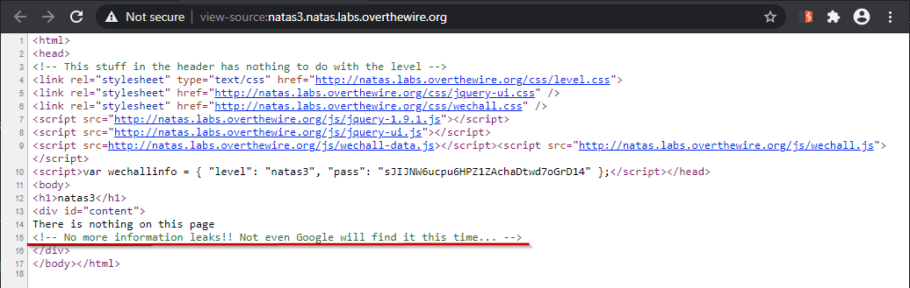

# Level 3

## Quest
Now we are greeted with a webpage similar to previous level, but when we look at its source code, we see there are no obvious hints.

 

## Solution
Well if we look carefully, there is a subtle hint in the line : "_Not even Google will find it this time..."_. Google crawlers usually look at `robots.txt` of websites to decide which of its pages it can index and which it can't. 
When we visit `robots.txt` , we see only one path which is disallowed. When we visit it, this finally reveals the password for next level.

 

[<< Back](https://grey-fish.github.io/Natas/index.html)
