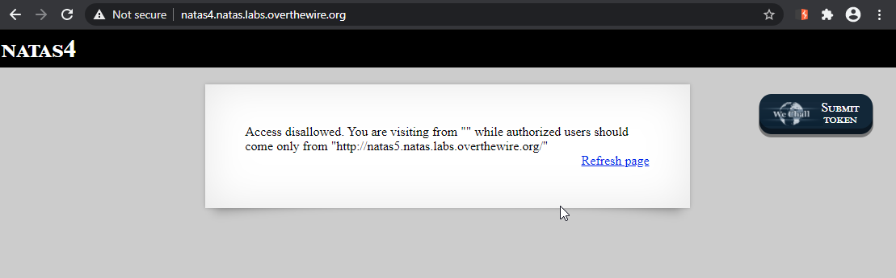
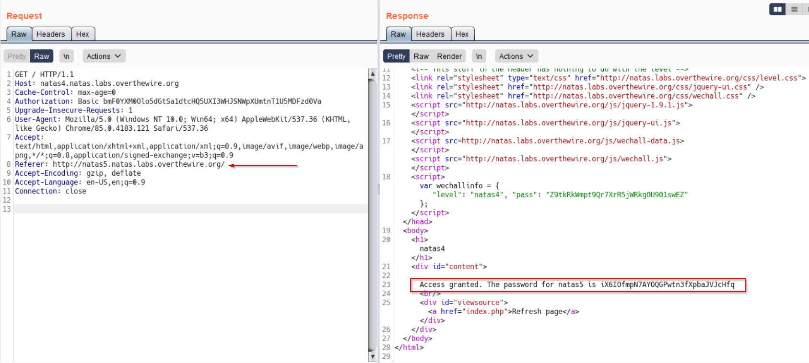

# Level 4
First time i use Burp to solve a challenge.

## Quest
We are presented with the following webpage. 

 

## Solution
It clearly mentions that we will be granted password, when we come from a particular URL. In HTTP, the Server uses `Referer` header to find out that which URL has made the request. 
So to solve this level, capture the request in burp, send it to the repeater and add a `Referer` header manually.

 

[<< Back](https://grey-fish.github.io/Natas/index.html)
