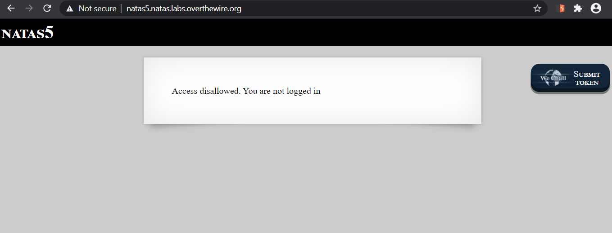
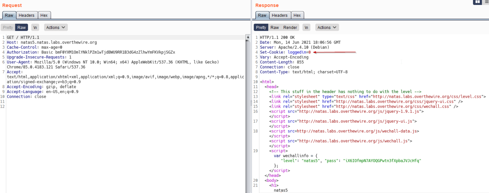
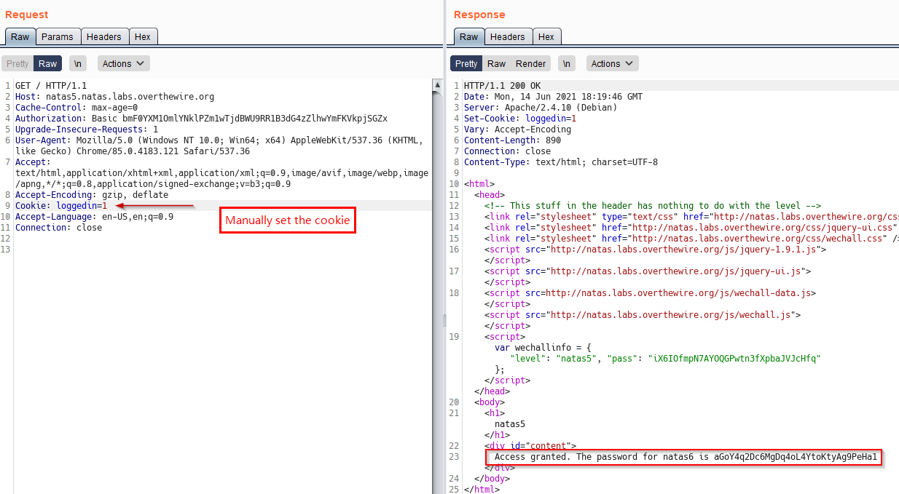

# Level 5
We need to analyze the HTTP response in order to succeed in this level

## Quest
We are presented with a webpage with a simple message "_Access disallowed. You are not logged in_" as shown below

 

## Solution
Below is the request and response in Burp. Notice the Header in the response : `Set-Cookie: loggedin=0`. The `Set-Cookie` header is used to set the cookies that will be sent in the subsequent requests.

 
 
If we change its value to `loggedin=1` indicating success (_means we have already logged in successfully_), we might get in. 

 

And Indeed, we can see above that this worked, and we have the password for next Level.

 

[<< Back](https://grey-fish.github.io/Natas/index.html)
