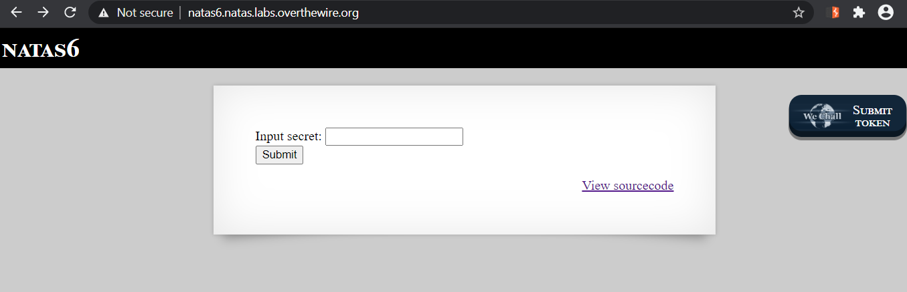
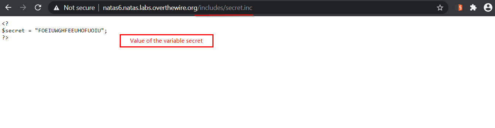
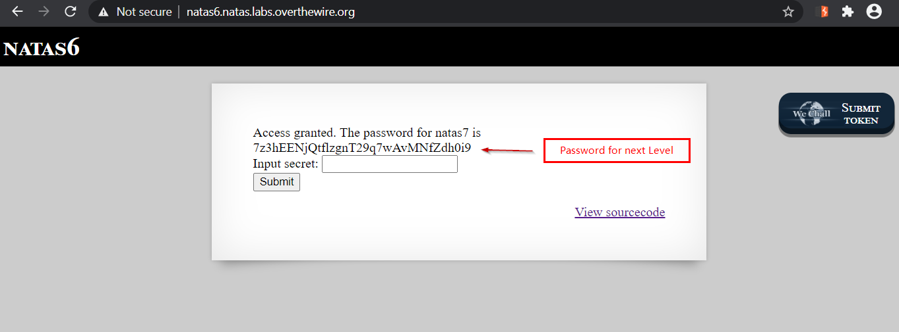

# Level 6
In this Level we get our first taste of PHP

## Quest
We are presented with a simple webpage contain a form with only one `input` element, as evident below.



We are also provided sourcecode (PHP) of the page. I'll comment the code below
```php
<?

include "includes/secret.inc";             // Include code from file present in path "includes/secret.inc"

  if(array_key_exists("submit", $_POST)) { // Check if form is submitted
    if($secret == $_POST['secret']) {      // if in our POST request, value of param secret is equal to predefined var secret
      print "Access granted. The password for natas7 is <censored>";  // Access is granted and password revealed
    } else {
      print "Wrong secret";                // Else, we output this message
    }
  }
?>
```

## Solution 
In source code, the line `include "includes/secret.inc"` means there is a secret.inc file, which this page relies own. Lets check that



Now that we have value of `secret`, we simply put this into our input and this reveals the password.



<br/>

[<< Back](https://grey-fish.github.io/Natas/index.html)
