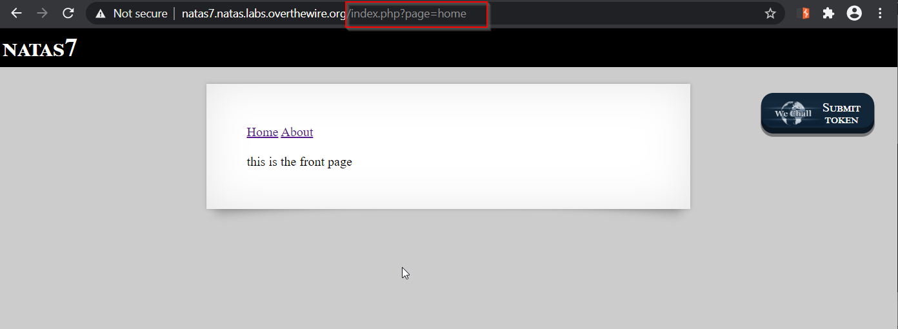
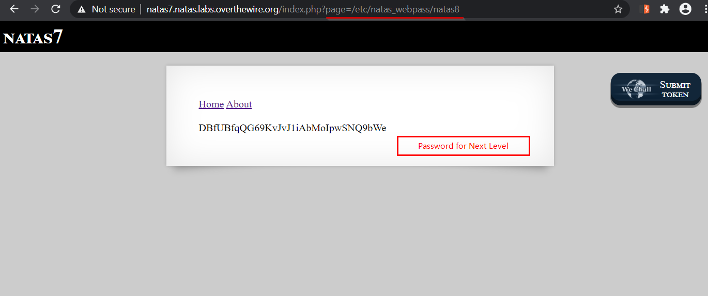

# Natas Level 7
A Simple exercise in Path Traversal Vulnerability

## Quest
We are presented with a simple web page, with two links "Home" and "About". 

When we look at the page source, we see that password for next level is stored in `/etc/natas_webpass/natas8` file.

 
 

## Solution
Look at the urls: 
  Home : `http://natas7.natas.labs.overthewire.org/index.php?page=home` 
  About : `http://natas7.natas.labs.overthewire.org/index.php?page=about` 
  
We'll check if query parameter page is vulnerable to Path Traversal (also called Directory Traversal) attack.  
  Our payload :  `page=/etc/natas_webpass/natas8`

As we can see above, our attack worked, the page is vulnerable to Directory traversal attack.

Tip! - Try using any other file like `/etc/passwd`.

 

[<< Back](https://grey-fish.github.io/Natas/index.html)
