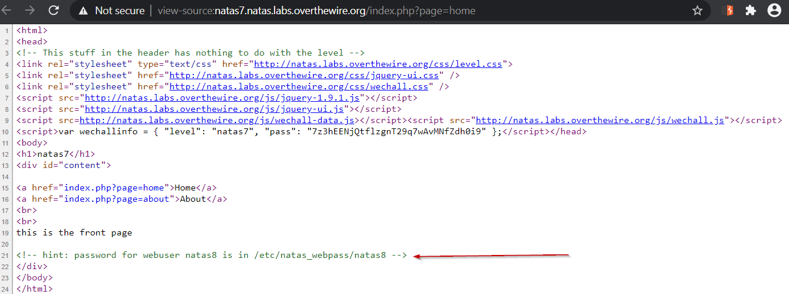

# Level 7
A Simple exercise in Path Traversal Vulnerability

## Quest
We are present with a simple web page, with two link "Home" and "About". 

When we look at the page source, we see that password for next level is stored in `/etc/natas_webpass/natas8` file.

## Solution
Look at the urls:
  Home  : `http://natas7.natas.labs.overthewire.org/index.php?page=home`
  About : `http://natas7.natas.labs.overthewire.org/index.php?page=about`
  
We will check if the query parameter `page` is vulnerable to Path Traversal (also called Directory Traversal) attack.
Our payload :  `page=/etc/natas_webpass/natas8`

As we can see above, our attack worked, the page is vulnerable to Directory traversal attack.

 

[<< Back](https://grey-fish.github.io/Natas/index.html)
