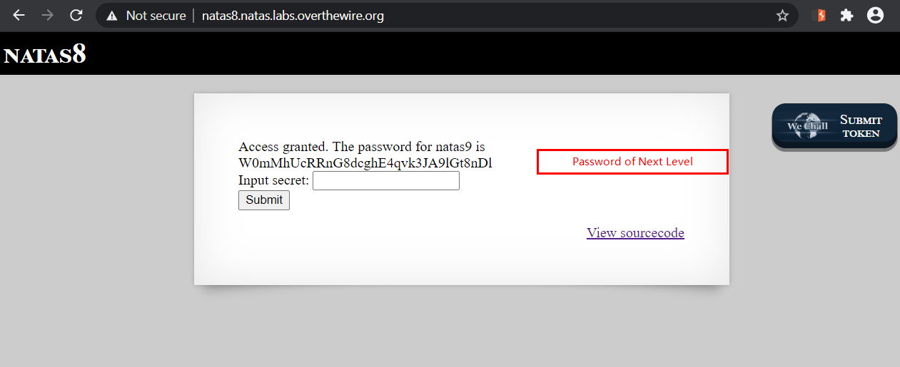

# Level 8
This level requires basic PHP skills

## Quest
We are presented with a similar page like in [Level 6](./Level6.md), but this time with a different backend code.


Here is the new backend code
```php
<?
$encodedSecret = "3d3d516343746d4d6d6c315669563362";

function encodeSecret($secret) {
    return bin2hex(strrev(base64_encode($secret)));
}

if(array_key_exists("submit", $_POST)) {
    if(encodeSecret($_POST['secret']) == $encodedSecret) {
    print "Access granted. The password for natas9 is <censored>";
    } else {
    print "Wrong secret";
    }
}
?>
```
<br/>
<br/>

## Solution

Look at the code, we're asked to input a value, which when encoded will be equal to `"3d3d516343746d4d6d6c315669563362"`<br/> 
Fortunately, we can read the function used to perform encoding. Our task is to analyze it and reverse-engineer it.

```php
function encodeSecret($secret) {
    return bin2hex(strrev(base64_encode($secret)));
}
```
Above function does the following<br/>
    secret -> `base64_encode` -> `strrev` -> `bin2hex` -> Encoded secret

Now to get our secret we need to follow above steps in reverse order. Which basically means<br/>
    Encoded secret -> `hex2bin` -> `strrev` -> `base64_decode` -> secret
  
 Below i have done exactly that, To see different stages, i go step by step :
 ```php
 $encodedSecret = "3d3d516343746d4d6d6c315669563362";

echo hex2bin($encodedSecret);          // ==QcCtmMml1ViV3b

echo strrev(hex2bin($encodedSecret));  // b3ViV1lmMmtCcQ==

echo base64_decode(strrev(hex2bin($encodedSecret)));  // oubWYf2kBq
```

The final output `oubWYf2kBq` is the original string that we obtain after deencoding the encoded secret.
<br/>
<br/>
When we give this as input, the password for next level is revealed. 


<br/>
<br/>
This level forced me to read PHP documentation about the mentioned functions and i came to know about there counterparts.

<br/>

[<< Back](https://grey-fish.github.io/Natas/index.html)
